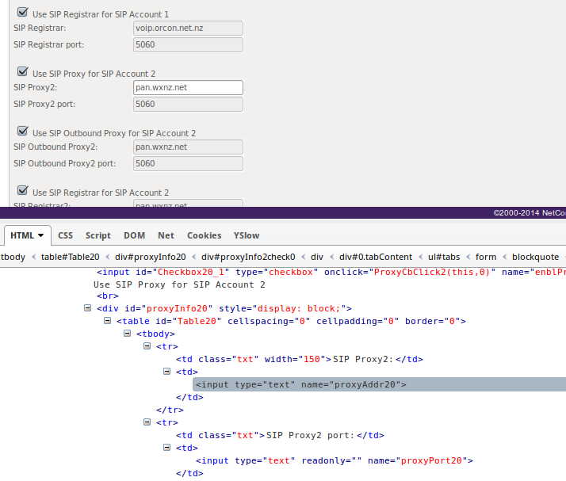

+++
date = "2015-04-09T16:01:54+13:00"
draft = false
title = "WXC VoIP on an Orcon Genius/Netcomm NV4F"
slug = "wxc-voip-on-an-orcon-geniusnetcomm-nv4f"
+++

*Disclaimer: This should not be read as an endorsement or criticism of either Orcon or WXC. A review of these services may appear later if I feel I have something worth talking about*

I recently switched to Fibre broadband through Orcon, and decided that I really didn't want to paid the $30 a month[[1](#an-1)] for the privilege of having a VoIP account when there are other companies that can provide the same service for less.

After a bit of research I decided to subscribe the 'Open VFX' service from WXC. I picked up a cheep analog handset, with the intention of using the modem Orcon provides[[2](#an-2)] as an ATA[[3](#an-3)], because it conveniently has a two port ATA built in, the intention being for you to use it with the Orcon VoIP service.

The modem in question is a Netcomm NF4V, which Orcon brands as a 'Genius White', and in theory this should just work. SIP is a standard protocol, and the modem supports the standard set of audio codecs. The fun starts with the custom firmware that Orcon puts on their modems, which locks down the SIP settings in the admin interface so that it will only talk to the Orcon SIP servers. Fortunately they did a *really bad* job of locking down the admin interface, so its fairly straight forward to change these settings. All of the validation is done on the client side[[4](#an-4)], so we can use the developer tools in the browser to disable the validation.

Simply open the developer tools in your browser[[5](#a-5)] and remove the 'readonly' attribute from the input elements.

Once you have disabled the validation, you are now free to configure the SIP services. When you subscribe with WXC, they will send you an email listing the settings for WXC, but they use different names than the admin panel in the modem. The settings should be filled out as shown below

<table class="table table-striped">
<tbody>
<tr>
<td><b>Modem Settings</b></td>
<td><b>Email from WXC</b></td>
</tr>
<tr>
<td>SIP Proxy</td>
<td>Proxy</td>
</tr>
<tr>
<td>SIP Outgoing Proxy</td>
<td>Proxy</td>
</tr>
<tr>
<td>SIP Registrar</td>
<td>Proxy</td>
</tr>
<tr>
<td>Authentication Name</td>
<td>AuthUser</td>
</tr>
<tr>
<td>Password</td>
<td>AuthPassword</td>
</tr>
<tr>
<td>Cid Name</td>
<td>UserID</td>
</tr>
<tr>
<td>Cid Number</td>
<td>UserID</td>
</tr>
</tbody>
</table>

#### Notes

1. NZD, at the time of writing
2. and requires you to use if you want to talk to their support people
3. Analog Telephone Adapter - basically a VoIP-to-analog bridge
4. My theory is that Orcon can't change the CGI code on the modem because it would need a lot of validation, but changes to the admin theme are just fine
5. I'm using Firefox in the screenshot, although you can do the same thing with Chromium
